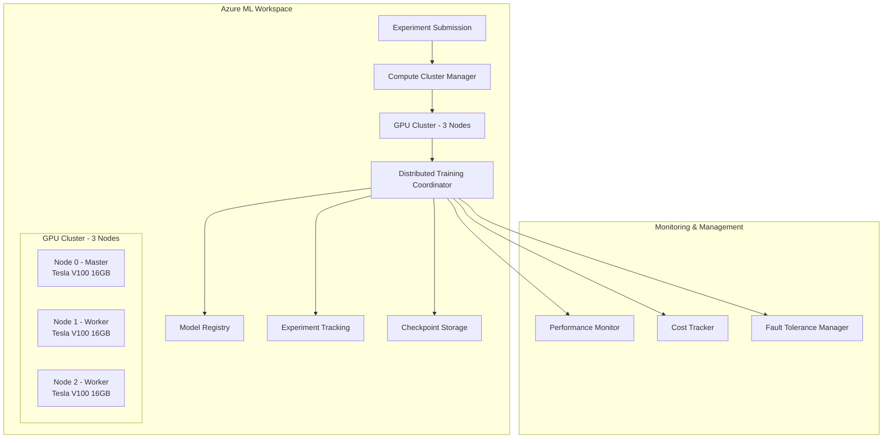
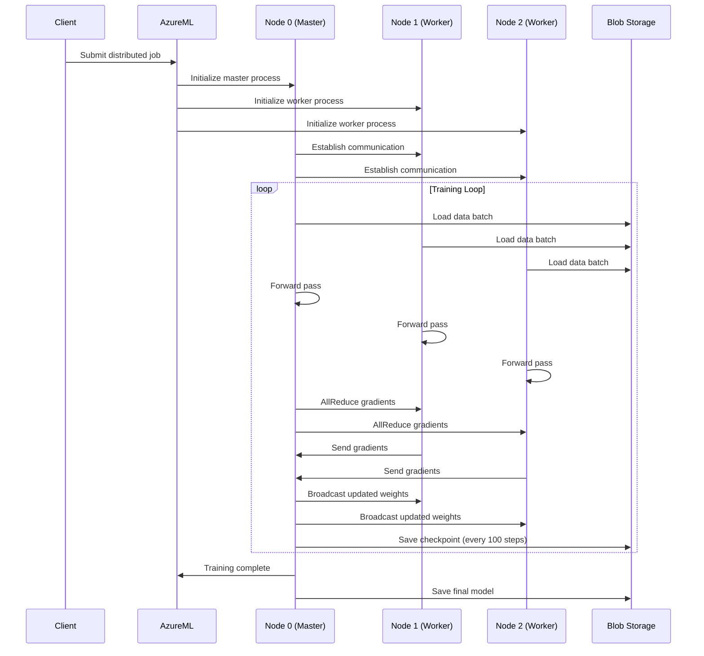

# Design Document: Distributed GPU Training System

## Overview

This system implements enterprise-grade distributed GPU training for stock price prediction models using Azure ML. The architecture leverages PyTorch DistributedDataParallel (DDP) across multiple GPU nodes, with intelligent resource management, fault tolerance, and comprehensive monitoring.

## Architecture

### High-Level Architecture



### Distributed Training Flow



## Components and Interfaces

### 1. Compute Cluster Manager

**Purpose:** Manages GPU cluster lifecycle and resource allocation

**Key Classes:**
- `GPUClusterManager`: Handles cluster provisioning and scaling
- `ResourceOptimizer`: Monitors utilization and recommends optimizations
- `CostTracker`: Tracks and reports compute costs

**Interfaces:**
```python
class GPUClusterManager:
    def provision_cluster(self, node_count: int, gpu_type: str) -> ClusterConfig
    def scale_cluster(self, target_nodes: int) -> bool
    def monitor_health(self) -> ClusterHealth
    def cleanup_cluster(self) -> None
```

### 2. Distributed Training Coordinator

**Purpose:** Orchestrates distributed training across multiple nodes

**Key Classes:**
- `DistributedTrainer`: Main training orchestrator
- `DataShardManager`: Handles data distribution across nodes
- `GradientSynchronizer`: Manages gradient aggregation
- `CheckpointManager`: Handles fault tolerance and recovery

**Interfaces:**
```python
class DistributedTrainer:
    def initialize_distributed(self, world_size: int, rank: int) -> None
    def setup_data_parallel(self, model: torch.nn.Module) -> torch.nn.parallel.DistributedDataParallel
    def train_epoch(self, dataloader: DataLoader) -> Dict[str, float]
    def synchronize_metrics(self, metrics: Dict[str, float]) -> Dict[str, float]
```

### 3. Performance Monitor

**Purpose:** Real-time monitoring of training performance and resource utilization

**Key Classes:**
- `NodeMonitor`: Tracks per-node metrics
- `CommunicationProfiler`: Monitors inter-node communication overhead
- `PerformanceDashboard`: Aggregates and visualizes metrics

**Interfaces:**
```python
class NodeMonitor:
    def collect_gpu_metrics(self) -> GPUMetrics
    def collect_network_metrics(self) -> NetworkMetrics
    def collect_training_metrics(self) -> TrainingMetrics
    def send_to_dashboard(self, metrics: Dict) -> None
```

## Data Models

### ClusterConfig
```python
@dataclass
class ClusterConfig:
    cluster_name: str
    node_count: int
    gpu_type: str  # e.g., "Standard_NC6s_v3"
    auto_scale_enabled: bool
    min_nodes: int
    max_nodes: int
    idle_timeout_minutes: int
```

### DistributedTrainingConfig
```python
@dataclass
class DistributedTrainingConfig:
    world_size: int
    backend: str  # "nccl" for GPU
    master_addr: str
    master_port: int
    batch_size_per_gpu: int
    gradient_accumulation_steps: int
    checkpoint_frequency: int
```

### TrainingMetrics
```python
@dataclass
class TrainingMetrics:
    node_id: int
    epoch: int
    step: int
    loss: float
    gpu_utilization: float
    gpu_memory_used: float
    throughput_samples_per_sec: float
    communication_time_ms: float
    timestamp: datetime
```

### CostMetrics
```python
@dataclass
class CostMetrics:
    cluster_name: str
    total_cost_usd: float
    cost_per_node_hour: float
    training_duration_hours: float
    cost_per_epoch: float
    estimated_total_cost: float
```

## Error Handling

### Node Failure Recovery
1. **Detection:** Health checks every 30 seconds detect unresponsive nodes
2. **Isolation:** Failed nodes are removed from the training group
3. **Recovery:** Training continues with remaining nodes from latest checkpoint
4. **Replacement:** New nodes can be added dynamically if available

### Communication Failures
1. **Timeout Handling:** 60-second timeout for gradient synchronization
2. **Retry Logic:** 3 automatic retries with exponential backoff
3. **Fallback:** Switch to parameter server mode if AllReduce fails
4. **Logging:** Detailed communication error logs for debugging

### Resource Exhaustion
1. **Memory Monitoring:** Track GPU memory usage per node
2. **Batch Size Adjustment:** Automatically reduce batch size if OOM occurs
3. **Gradient Checkpointing:** Enable memory-efficient training for large models
4. **Graceful Degradation:** Fall back to CPU training if GPU resources exhausted

## Testing Strategy

### Unit Tests
- **Cluster Management:** Test cluster provisioning, scaling, and cleanup
- **Data Sharding:** Verify correct data distribution across nodes
- **Gradient Synchronization:** Test AllReduce operations with mock data
- **Checkpoint Recovery:** Validate checkpoint save/load functionality

### Integration Tests
- **End-to-End Training:** Complete distributed training run with synthetic data
- **Fault Tolerance:** Simulate node failures during training
- **Cost Tracking:** Verify accurate cost calculation and reporting
- **Azure ML Integration:** Test experiment logging and model registration

### Performance Tests
- **Scaling Efficiency:** Measure training speedup with 1, 2, and 3 nodes
- **Communication Overhead:** Profile inter-node communication costs
- **Memory Utilization:** Test with various batch sizes and model sizes
- **Cost Optimization:** Validate auto-scaling and resource optimization

### Load Tests
- **Concurrent Jobs:** Multiple distributed training jobs simultaneously
- **Large Dataset:** Training with datasets exceeding single-node memory
- **Extended Training:** Long-running training jobs (>24 hours)
- **Resource Contention:** Training under resource-constrained conditions

## Security Considerations

### Network Security
- **VNet Integration:** All nodes communicate within Azure VNet
- **Firewall Rules:** Restrict communication to training ports only
- **TLS Encryption:** Secure inter-node communication channels

### Data Security
- **Encryption at Rest:** All checkpoints and data encrypted in Blob Storage
- **Access Control:** Role-based access to compute resources and data
- **Audit Logging:** Complete audit trail of all training operations

### Credential Management
- **Managed Identity:** Use Azure Managed Identity for service authentication
- **Key Vault Integration:** Secure storage of sensitive configuration
- **Least Privilege:** Minimal required permissions for each component