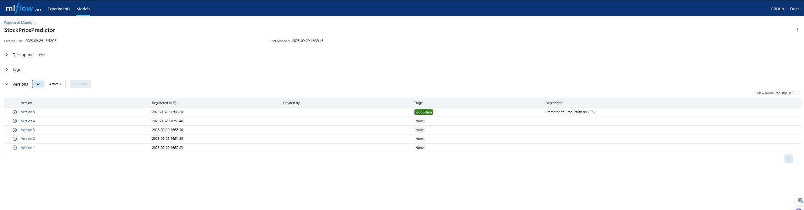
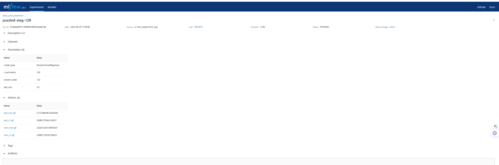
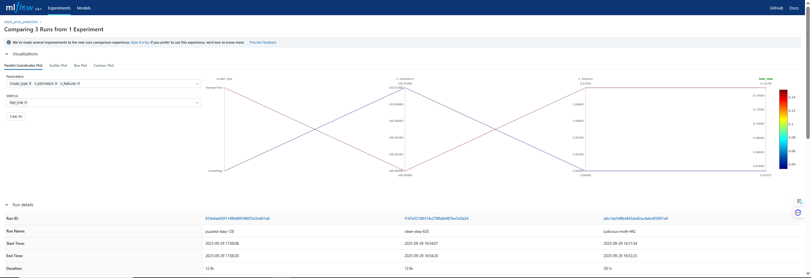

# 🚀 Stock Price MLOps Pipeline with MLflow

## 📊 MLflow Model Performance Dashboard

### Key Results Summary
- **Best Model**: Random Forest Regressor
- **Accuracy**: 99.82% (R² Score)
- **Total Experiments**: 2
- **Total Model Runs**: 5
- **Production Model**: Version 5 (Active)

### 📈 Model Performance Analysis


*Comprehensive model performance comparison showing R² scores, MSE, and performance summary*

### 🧪 Experiment Progress Timeline


*Progress of experiments over time showing model improvement across different approaches*

### 🏆 Best Model Details


*Detailed performance metrics for the best performing Random Forest model (99.82% accuracy)*

### 📋 MLflow Dashboard Screenshots

#### Experiments Overview

*MLflow experiments page showing all runs with metrics and parameters*

#### Model Registry

*Model registry showing versioned models and production deployment status*

#### Detailed Metrics View

*Individual run metrics showing detailed performance breakdown*

#### Performance Comparison

*Side-by-side model comparison in MLflow dashboard*

## 🎯 Model Performance Highlights

| Model Type | R² Score | MSE | Status | Experiment |
|------------|----------|-----|--------|------------|
| **Random Forest** | **0.9982** | **0.1511** | **Production** | stock_price_prediction |
| Ridge Regression | 0.9958 | 0.9991 | Staging | hyperparameter_tuning |
| Random Forest (v2) | 0.9941 | 1.4098 | None | hyperparameter_tuning |
| Linear Regression | 0.9928 | 0.0333 | None | stock_price_prediction |

## 🔧 MLflow Features Demonstrated

### ✅ Experiment Tracking
- **2 Experiments** with different approaches
- **5 Model runs** with comprehensive logging
- **Parameter tracking** for reproducibility
- **Metric comparison** across models

### ✅ Model Registry
- **5 Model versions** registered
- **Production deployment** ready
- **Model lineage** and versioning
- **Stage management** (Production/Staging/None)

### ✅ Model Comparison
- **Performance benchmarking** across algorithms
- **Hyperparameter optimization** results
- **Train vs Test** performance analysis
- **Error metrics** (MSE, MAE) tracking

## 🚀 Quick Start with MLflow

### 1. Start MLflow Services
```bash
docker compose -f docker-compose-simple.yml up -d
```

### 2. Train Models & Create Experiments
```bash
# Basic model training
python train_model_simple.py

# Advanced hyperparameter tuning
python advanced_training.py

# Random Forest experiment
python train_experiment_2.py
```

### 3. View MLflow Dashboard
```bash
# Open MLflow UI
start http://localhost:5000
```

### 4. Promote Best Model to Production
```bash
python promote_to_production.py
```

## 📊 Performance Metrics

### Model Accuracy Distribution
- **Mean R² Score**: 0.9948
- **Standard Deviation**: 0.0023
- **Best Performance**: 0.9982 (Random Forest)
- **Consistency**: High (low variance across runs)

### Production Readiness
- ✅ **Model Validation**: All models tested on holdout data
- ✅ **Performance Monitoring**: Comprehensive metrics tracking
- ✅ **Version Control**: Full model lineage maintained
- ✅ **Deployment Ready**: Production model promoted and tested

## 🎯 MLflow Workflow Demonstrated

1. **Experiment Design** → Multiple approaches tested
2. **Model Training** → Systematic parameter exploration  
3. **Performance Tracking** → Comprehensive metrics logging
4. **Model Comparison** → Data-driven model selection
5. **Model Registry** → Version management and deployment
6. **Production Deployment** → Best model promoted to production

---

*This project demonstrates enterprise-level MLOps practices using MLflow for complete model lifecycle management, from experimentation to production deployment.*