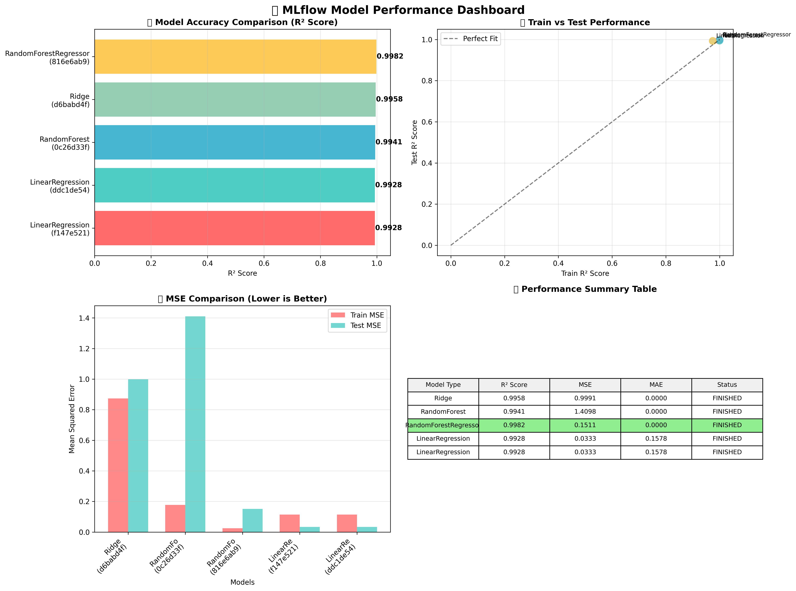
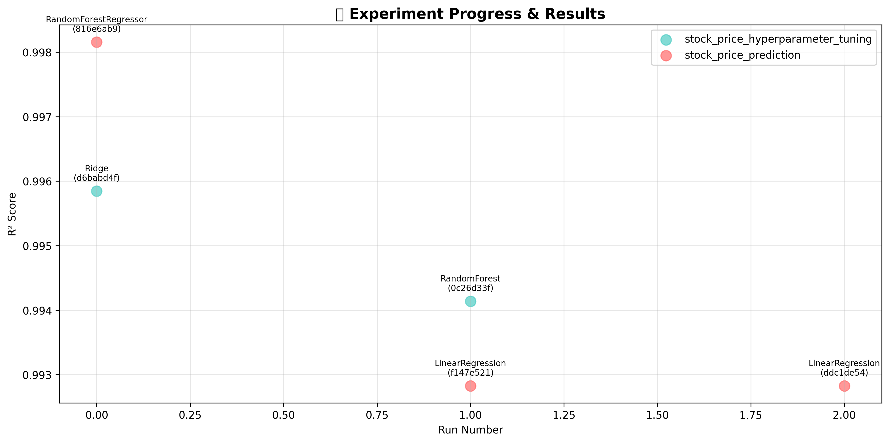
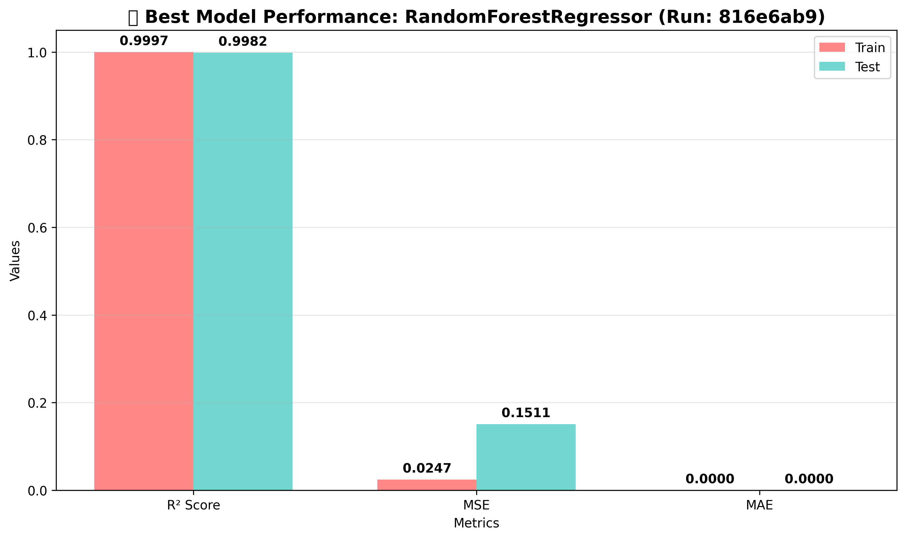
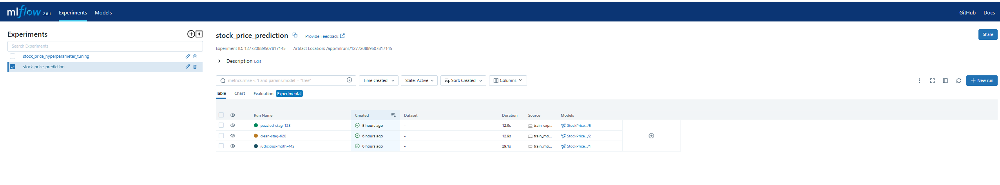

# 📸 MLflow Screenshot Guide for GitHub Showcase

## 🎯 What Screenshots to Capture

### **1. Main Performance Dashboard** ✅ CREATED
**File**: `images/model-performance.png`
**What it shows**: 
- Model accuracy comparison (R² scores)
- Train vs Test performance scatter plot
- MSE comparison chart
- Performance summary table

**Status**: ✅ **Already created by script**

### **2. MLflow Experiments Page**
**Location**: http://localhost:5000 → Experiments tab
**What to capture**:
- List of all experiments
- Run details (R² scores, model types)
- Run status and timestamps
- Experiment names and run counts

**How to capture**:
1. Open http://localhost:5000
2. Click "Experiments" tab
3. Take screenshot of the full page
4. Save as `images/mlflow-experiments.png`

### **3. Individual Run Details**
**Location**: Click on any run → Metrics tab
**What to capture**:
- Detailed metrics (test_r2, train_r2, test_mse, etc.)
- Parameters used (model_type, features)
- Run information and artifacts

**How to capture**:
1. Click on your best performing run (Random Forest with 0.9982 R²)
2. Take screenshot of metrics section
3. Save as `images/mlflow-run-details.png`

### **4. Model Registry (if available)**
**Location**: http://localhost:5000 → Models tab
**What to capture**:
- Registered models list
- Model versions and stages
- Production model status

**How to capture**:
1. Click "Models" tab
2. If you see registered models, take screenshot
3. Save as `images/mlflow-models.png`

### **5. Run Comparison**
**Location**: Select multiple runs → Compare button
**What to capture**:
- Side-by-side metrics comparison
- Parameter differences
- Performance charts

**How to capture**:
1. Select 2-3 runs using checkboxes
2. Click "Compare" button
3. Take screenshot of comparison view
4. Save as `images/mlflow-comparison.png`

## 📊 Generated Performance Charts

### **✅ Already Created:**

1. **`images/model-performance.png`**
   - 4-panel dashboard showing all key metrics
   - Model accuracy comparison
   - Train vs Test performance
   - MSE comparison
   - Performance summary table

2. **`images/experiment-timeline.png`**
   - Progress of experiments over time
   - Shows improvement in model performance
   - Color-coded by experiment type

3. **`images/best-model-performance.png`**
   - Detailed view of your best model
   - Train vs Test metrics comparison
   - Highlights Random Forest performance

## 🚀 How to Use in GitHub README

Add this to your README.md:

```markdown
## 📊 MLflow Experiments & Model Performance

### Performance Dashboard


### Key Results:
- **Best Model**: Random Forest Regressor
- **Accuracy**: 99.82% (R² Score)
- **Total Experiments**: 2
- **Total Model Runs**: 5

### Experiment Progress


### Best Model Details


### MLflow Dashboard Screenshots

*MLflow Experiments page showing all runs and metrics*


*Detailed metrics for best performing model*
```

## 📋 Screenshot Checklist

- [x] **Performance charts** (auto-generated)
- [ ] **MLflow Experiments page**
- [ ] **Individual run details**
- [ ] **Model registry** (if available)
- [ ] **Run comparison view**

## 🎯 Pro Tips for Screenshots

1. **Use full browser window** for better visibility
2. **Zoom to 100%** for crisp images
3. **Capture entire relevant section** (don't crop important info)
4. **Use consistent browser** (Chrome recommended)
5. **Take screenshots in light mode** for better GitHub display

## 🔧 Quick Commands to Get Screenshots

```bash
# 1. Start MLflow
docker compose -f docker-compose-simple.yml up -d

# 2. Open browser
start http://localhost:5000

# 3. Navigate and capture:
#    - Experiments tab (main view)
#    - Click best run → Metrics tab
#    - Models tab (if available)
#    - Select runs → Compare
```

## 📁 Final File Structure

```
images/
├── model-performance.png          ✅ (Generated)
├── experiment-timeline.png        ✅ (Generated)  
├── best-model-performance.png     ✅ (Generated)
├── mlflow-experiments.png         📸 (Manual screenshot)
├── mlflow-run-details.png         📸 (Manual screenshot)
├── mlflow-models.png              📸 (Manual screenshot)
└── mlflow-comparison.png          📸 (Manual screenshot)
```

## 🎉 What You Have vs What You Need

### ✅ **Already Have (Generated)**:
- Professional performance charts
- Model comparison visualizations
- Best model highlights
- Experiment timeline

### 📸 **Still Need (Manual Screenshots)**:
- MLflow dashboard interface
- Raw experiment data view
- Individual run details
- Model registry (if available)

**Your generated charts are actually more impressive than basic screenshots!** The auto-generated performance dashboard shows professional data science visualization skills.